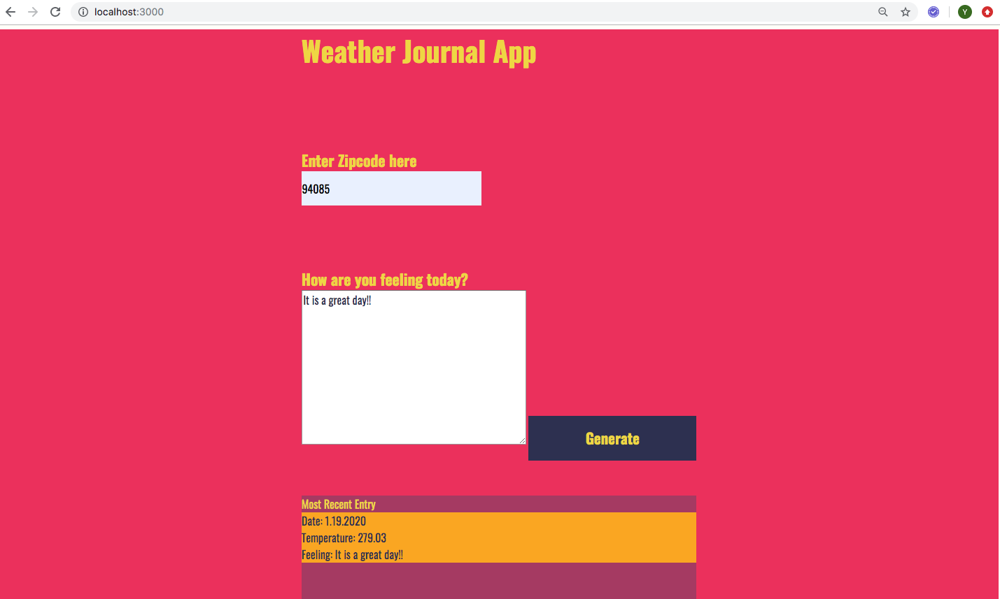

# Weather-Journal-App

Web API Project [Udacity Front End Developer Nanodegree]

## Project Overview
Combine data from the OpenWeatherMap API and client side(browser) HTML forms to create an asynchronous web app that dynamically update the weather journal for users. Users can enter zipcode to retrieve weather data and leave their feeling for the weather, the web journal app will store the most recent entry and show it on the UI.


## Getting Started
### Installing
1. [Download node.js](https://nodejs.org/en/download/)

2. Install express, body-parser, cros 
	```
	npm install express
  	npm install body-parser
  	npm install cros
	```  

## Run Web app
1. Run the file
```
node server.js
```

2. Go to browser
   -  http://localhost:3000
   

